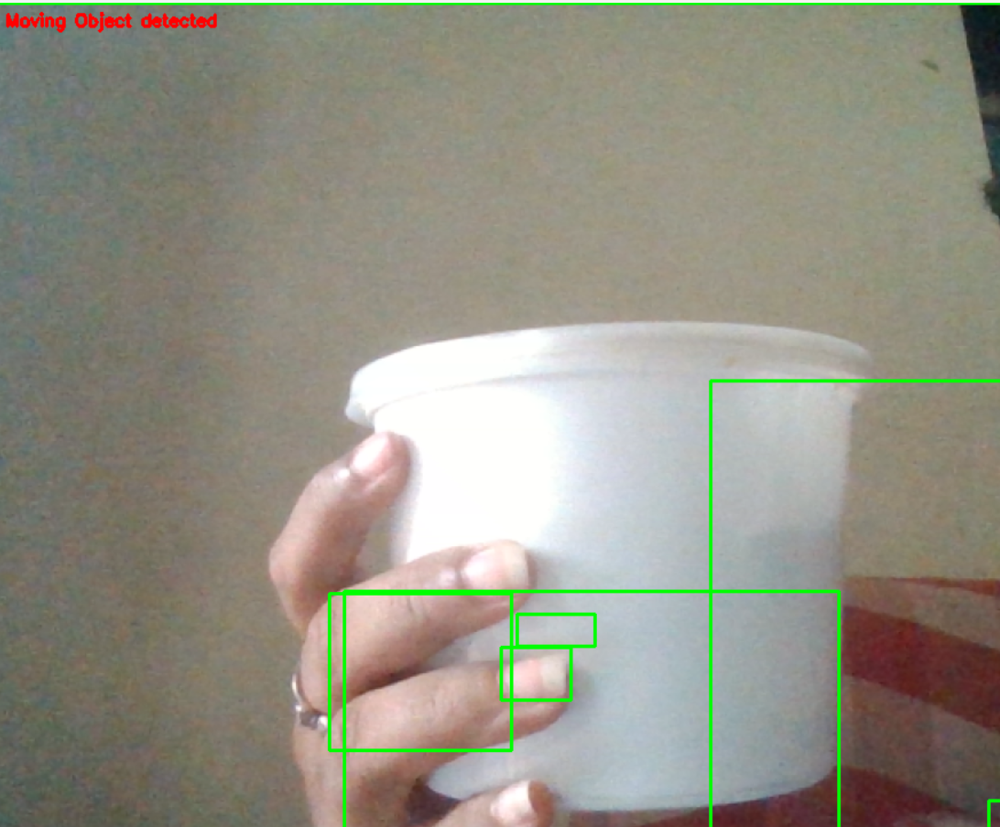

# 🎥 Real-Time Moving Object Detection using OpenCV

This project implements a real-time moving object detection system using Python and OpenCV.  
It detects motion from a live webcam feed and highlights the moving region with a bounding box.

---

## 📌 Project Overview

The system captures live video frames from the webcam and compares each frame with an initial background frame.  
If significant differences are detected, it identifies them as motion and draws a bounding box around the moving object.

This project demonstrates fundamental Computer Vision concepts such as:

- Background Subtraction
- Frame Differencing
- Image Thresholding
- Contour Detection
- Real-Time Video Processing

---

## 🛠 Technologies Used

- Python
- OpenCV (cv2)
- Imutils

---

## ⚙️ How It Works

1. Capture video from webcam.
2. Convert frame to grayscale.
3. Apply Gaussian Blur to reduce noise.
4. Store the first frame as reference background.
5. Compute absolute difference between background and current frame.
6. Apply thresholding to highlight motion areas.
7. Use dilation to remove small holes.
8. Detect contours.
9. Draw bounding box around moving objects.
10. Display detection status on screen.

---

## 📸 Project Output

### 🟢 Moving Object Detected



When motion is detected:
- A green bounding box appears around the moving object.
- Status changes to **"Moving Object detected"**.

---

## ▶️ Installation & Setup

### 1️⃣ Clone the Repository

```bash
git clone https://github.com/your-username/moving-object-detection.git
cd moving-object-detection
```

### 2️⃣ Install Required Libraries

```bash
pip install opencv-python imutils
```

### 3️⃣ Run the Application

```bash
python moving_object_detection.py
```

Press **'q'** to exit the webcam window.

---

## 📂 Project Structure

```
moving-object-detection/
│
├── moving_object_detection.py
├── README.md
└── screenshots/
    └── motion_detected.png
```

---

## 🚀 Future Improvements

- Save detected frames automatically
- Add video recording functionality
- Improve lighting adaptability
- Integrate Deep Learning models (YOLO / SSD) for object classification
- Reduce false positives

---

## 🎯 Key Learning Outcomes

- Understanding motion detection logic
- Real-time image processing using OpenCV
- Working with contours and thresholding
- Handling webcam streams in Python

---

## 👩‍💻 Author

Vaishnavi  
Aspiring Data Scientist  
Skilled in Python, Machine Learning, and Computer Vision
